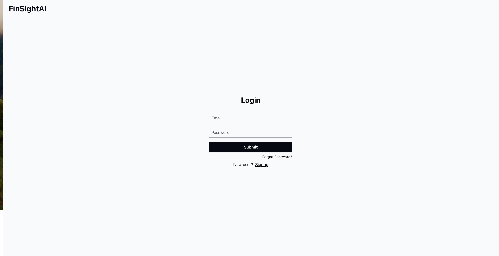
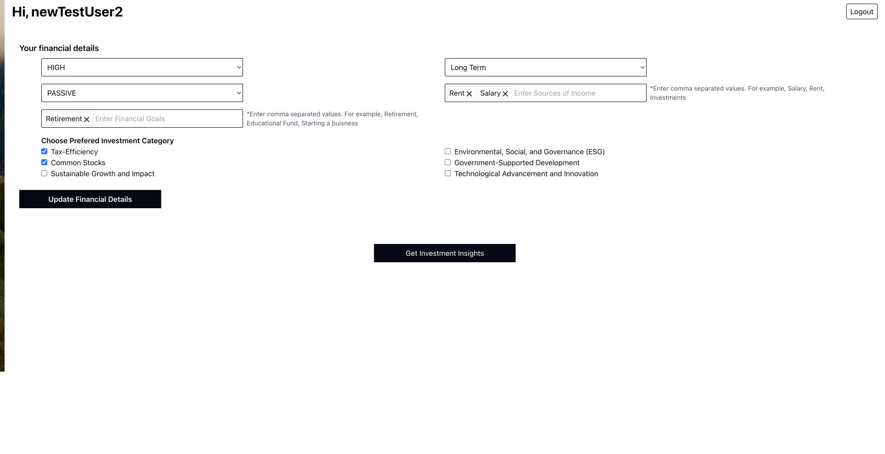
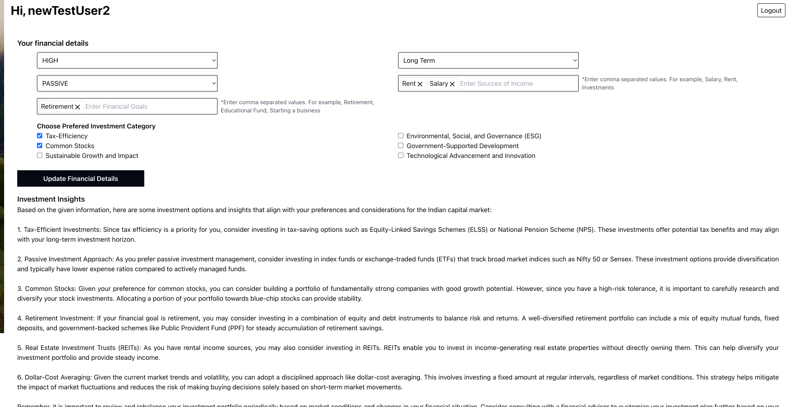

# FinSightAI

Welcome to the FinSightAI! This application provides investment insights based on user financial preferences.

## Description

The FinSightAI is a React application that leverages APIs to gather and analyze financial data, offering personalized investment recommendations.

## Installation

Follow these steps to set up and run the application locally:

1. **Clone the repository:**
   ```
   git clone (https://github.com/CyberneTech/FinSightAI-frontend.git
   cd FinSightAI-frontend
   ```

2. **Install dependencies:**
   ```
   npm install
   ```

3. **Configure API url:**
   - Obtain API urls for the two financial APIs (user-service and llm-service).
   - Create a `.env` file in the project root.
   - Add your API urls to the `.env` file:
     ```
     REACT_APP_API_URL=your-user-service-api-url
     REACT_APP_LLM_API_URL=your-llm-service-api-url
     ```

4. **Start the development server:**
   ```
   npm run start
   ```

## Usage

Once the development server is running, open your browser and navigate to [http://localhost:3000](http://localhost:3000) to access the FinSightAI. Create an account, enter your financial preferences, and the application will provide personalized investment insights.

## User Flow and Screenshots


Sign up and then login in the applciation
<br>


Add your financial preferences into the fields to create financial profile
<br>
  

Generate insights by clicking on the button to get investment suggestions / insights customized according to your preference.


## License
This project is licensed under the [MIT License](LICENSE).

Happy investing!
